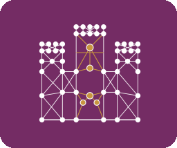

# Patrimonio Abierto



Links Castilla y León's open heritage data (Bienes de Interés Cultural) with
Wikidata, Wikimedia Commons, and Wikipedia - and shows the result on a map.

## The gap this project tracks

As of the last `make build` run (2026-08-26): **2,479** officially
protected monuments in Castilla y León, of which **1,785 (72%)** have a
matching Wikidata item and **694 (28%)** don't. See
`web/data/cyl_monuments_wikidata.json` for the full per-monument breakdown,
including 4 identifier conflicts (one JCyL ID claimed by two different
Wikidata items) worth resolving by hand.

Coverage is still uneven by category, but far less so than early on -
`HÓRREOS Y PALLOZAS` (traditional granaries) and `ROLLOS DE JUSTICIA`
(pillories) went from essentially untouched to 95% and 98% linked
respectively, driven by manual OpenRefine reconciliation/item-creation work
(see "Related, but not part of this repo" below for the tooling that came
out of that). The one
category still genuinely stuck is `ARTE RUPESTRE` (rock art, 347
monuments) at just **1% linked** - now the clearest remaining gap by far.
`CASTILLOS` (434 castles) is next at 53% linked, still real work left
despite being probably the single most visually compelling category for
this project's map.

## Data sources

Three sources, each queried differently, deliberately kept separate rather
than blended into one call:

| Source | What it's for | How |
|---|---|---|
| [JCyL WFS](https://idecyl.jcyl.es/geoserver) (`patrimoniocultural` / `limites` workspaces) | Ground truth: which monuments exist, category, protection date, footprint geometry, municipality boundaries | HTTP GET, GeoJSON, no auth. `scripts/fetch_jcyl.py` |
| [Wikidata Query Service](https://query.wikidata.org/) | Which monuments already have a Wikidata item, via [`P3177`](https://www.wikidata.org/wiki/Property:P3177) ("Patrimonio Web JCyL ID") | SPARQL. `scripts/fetch_wikidata.py` |
| Wikipedia REST API + Commons `Special:FilePath` | Lead paragraph + photo for a monument, fetched live, per-item, only when its marker is clicked | `web/app.js`, at runtime in the browser |

JCyL's data license (from its own ISO 19139 metadata record): *"Sin validez
jurídica, carácter informativo. Uso libre y gratuito. Cita obligada a la
propiedad de la fuente: 'Junta de Castilla y León'."* - free use, mandatory
attribution. Combined with Wikidata (CC0) and Commons (per-file, mostly
CC-BY-SA), everything here is fine to combine publicly as long as each
source is attributed distinctly rather than blended into one vague credit.

## Pipeline

```
make fetch   # scripts/fetch_jcyl.py + fetch_wikidata.py -> data/raw/*.json
make build   # scripts/build_dataset.py -> web/data/cyl_monuments_wikidata.json
```

`build_dataset.py` does three things beyond a straight merge:

1. **Centroid** of each monument's polygon footprint (`scripts/geometry.py`,
   pure-Python area-weighted shoelace formula - no shapely/pyproj/GDAL
   dependency; reprojection to WGS84 is done server-side by the WFS request
   itself via `srsName=EPSG:4326`, not reimplemented here).
2. **Spatial join** against municipality boundaries to derive which
   municipality each monument sits in (point-in-polygon, bbox-prefiltered;
   99.8% exact match rate, the rest fall back to nearest-municipality -
   tracked internally during the build as an approx-match count printed to
   the console, not carried into the output).
3. **Municipality code normalization**: the source layer's own `c_ine` field
   is an 11-digit extended code, but Wikidata's
   [`P772`](https://www.wikidata.org/wiki/Property:P772) ("INE code") uses
   the 5-digit `c_prov_mun` form - verified against a real item
   (`Q15699`/León, `P772 = "24089"`) before trusting it. Only the P772 form
   (`municipality_ine_code_p772`) makes it into the output; the raw 11-digit
   code is used internally for the join and then dropped, so there's no
   ambiguity about which one to actually use for reconciliation.

Each output record also carries `already_linked` / `wikidata_qid` /
`wikidata_conflict` / `has_wikidata_image` (whether the linked item has a
`P18` main image - linked and "has a photo" are genuinely different things,
tracked separately) - this file doubles as the source dataset for OpenRefine
reconciliation work, not just map data. It intentionally does *not* carry
`name_raw` (JCyL's raw uppercase denomination - only `titlecase_es()`'s
cleaned-up `name` ships) or `category_code` (the numeric category, only its
`category` label) - neither is read anywhere in `web/app.js`, so both are
dropped at build time rather than shipped dead weight.

`make build` also appends today's coverage numbers (`total`/`linked`/
`with_image`) to `web/data/history.json` - one entry per calendar date,
re-running the same day updates that day's entry rather than duplicating.
This is what backs the in-app "Estadísticas" page: the point isn't just the
map, it's proving the linking work is real, ongoing progress rather than a
one-off snapshot for a submission deadline.

## The map (`web/`)

Plain Leaflet + vanilla JS, no build step. Loads
`web/data/cyl_monuments_wikidata.json` once in full (2,479 records is small
enough to load eagerly rather than paginate/tile), plots every monument as a
marker colored by linkage status, clustered via `leaflet.markercluster`
(clusters themselves colored by their own linked/missing ratio, not raw
count, so even zoomed out the map reads as "where the documentation gaps
are"). A filter button lets you toggle markers on/off by category, with a
live count per category. Clicking a marker fetches Wikidata's
`Special:EntityData` for that item (sitelinks + the `P18` image claim), then
the Wikipedia REST summary and a Commons thumbnail via `Special:FilePath` -
live, per click, not baked into the static dataset. Unlinked monuments show
their JCyL reference instead, with a "not yet on Wikidata" note.

Basemap tiles are CARTO's "Positron" style (light, muted, so markers/photos
stay the focus) - CARTO retired anonymous keyless access to this raster
service, so `web/app.js` carries a free, domain-restricted API key (request
one at [carto.com/basemaps/apikey](https://carto.com/basemaps/apikey/); it's
a public/client-side key by design, safe to commit). If tiles ever stop
loading, that key is the first thing to check.

```
make serve   # http://localhost:8000, for local development
```

## Deployment

Runs as its own container (`docker-compose.yml`, Caddy serving `web/` as
static files on internal port 80) with no exposed host ports or TLS of its
own - it's meant to sit behind an existing reverse proxy that terminates
TLS and routes a domain to it, rather than owning that itself. Wiring up
that reverse-proxy side is intentionally external to this repo (a
`reverse_proxy patrimonioabierto_web:80` site block wherever your ingress
config lives, joined to the same Docker network `docker-compose.yml`
declares).

On the host: `docker compose up -d` starts the container; it's reachable
once the reverse-proxy side above points at it. The container was
previously named `cylinked_web` (project rename) - if you're updating an
existing deployment rather than starting fresh, update the external
Caddyfile's `reverse_proxy` line to the new name in the same step, or the
site goes down until both sides match.

## Not built yet

- Category → Wikidata `P31` (instance of) mapping table - deliberately not
  guessed here, needs a careful pass since some categories (`MONUMENTO`) are
  too generic for a 1:1 mapping.
- "Add a photo" contribution flow - planned to deep-link into Commons'
  UploadWizard (with a pre-filled category) rather than build a custom
  upload/storage system, matching how Wiki Loves Monuments itself works.

## Related, but not part of this repo

Reconciling/creating the actual Wikidata items (the OpenRefine work behind
the `HÓRREOS Y PALLOZAS`/`ROLLOS DE JUSTICIA` numbers above) lives outside
this project: a sibling local-only tool, `wikidata-commons-map`, overlays a
Wikidata SPARQL query's results against a Commons category's geotagged
photos, to spot reusable photos for items that don't have one yet.
Deliberately not committed here or wired into any build/deploy - see its
own README if reused for another category.
